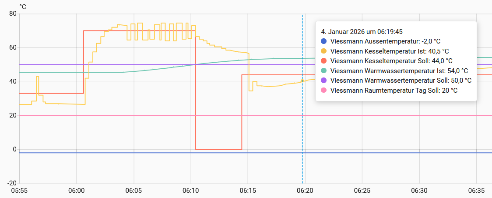
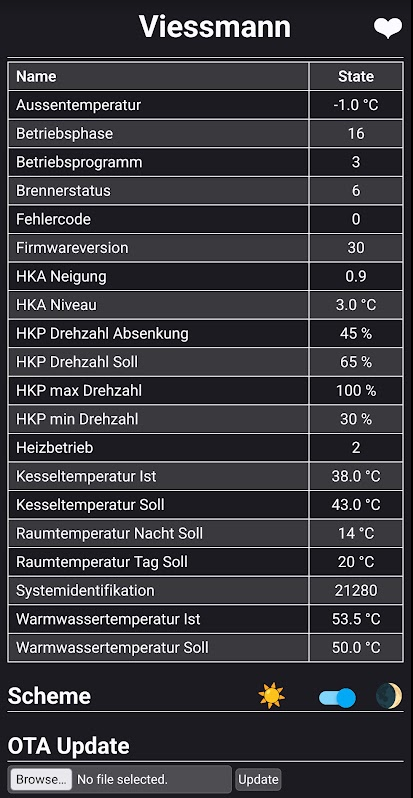

# GWG Protocol

The old Viessmann Optolink GWG protocol is used, for example, in the Vitodens 200 WB2 up to approximately the year 2000. Unlike the newer KW and P300 protocols, it only has an address range from 0x00 to 0xFFf. However, different targets are distinguished within the control system. These include virtual and physical addresses, EPROM, KM bus, and the control panel ([Source]). To differentiate between them, the most significant byte of the actual address is prepended. If this byte is missing or is 0x00, a physical read operation is performed.

To write to the address, the write flag must also be set. <b>Write operations are untested. There is a high risk of damaging the control system.</b>

## Usage

For usage, simply add the following to your config file. Example: Vitodens WB2.
Address, length and post processing can be retrieved from <https://github.com/openv/openv/wiki/Adressen>. Length of 2 bytes is by default interpreted as int16, 4 bytes as uint32. Both values are then converted to float.

```yaml
external_components:
  - source: github://dannerph/esphome_vitoconnect

esphome:
  name: viessmann-reader
  friendly_name: vitoconnect

esp32:
  board: esp32-s2-saola-1
  # board: esp32doit-devkit-v1

# esp8266:
  # board: nodemcuv2

uart:
  - id: uart_vitoconnect
    # set your RX and TX pins according to your wiring
    rx_pin: GPIO18  # ESP32-S2
    tx_pin: GPIO17  # ESP32-S2
    #rx_pin: GPIO16              # ESP32 RX2
    #tx_pin: GPIO17              # ESP32 TX2
    #rx_pin: GPIO03             # ESP8266 RX
    #tx_pin: GPIO01             # ESP8266 TX
    baud_rate: 4800
    data_bits: 8
    parity: EVEN
    stop_bits: 2
    # debug:
    #   direction: BOTH
    #   dummy_receiver: false
    #   after:
    #     delimiter: [0x06]
    #   sequence:
    #     - lambda: UARTDebug::log_hex(direction, bytes, ':');

vitoconnect:
  uart_id: uart_vitoconnect
  protocol: GWG                 # set protocol to GWG, KW or P300
  update_interval: 30s

sensor:
  - platform: vitoconnect
    name: "Aussentemperatur"
    address: 0x6F
    length: 1
    unit_of_measurement: "°C"
    accuracy_decimals: 1
    filters:
      - lambda: |-
          int8_t s = (x > 127) ? (int8_t)(x - 256) : (int8_t)x;
          return (float)s;
      - multiply: 0.5
  
  - platform: vitoconnect
    name: "Kesseltemperatur Ist"
    address: 0x70
    length: 1
    unit_of_measurement: "°C"
    accuracy_decimals: 1
    filters:
      - multiply: 0.5

  - platform: vitoconnect
    name: "Warmwassertemperatur Ist"
    address: 0x42
    length: 1
    unit_of_measurement: "°C"
    accuracy_decimals: 1
    filters:
      - multiply: 0.5
```
For more parameters, see [example-gwg-protocol.yaml](example-gwg-protocol.yaml).

Tested with OptoLink ESP32-S2 adapter from here:
<https://github.com/openv/openv/wiki/ESPHome-Optolink>

## Home Assistant 

Example of a visualization in Home Assistant.<p>


## Captive Portal

Captive Portal on the ESP32.<p>


[Source]: https://github.com/openv/openv/wiki/Protokoll-GWG